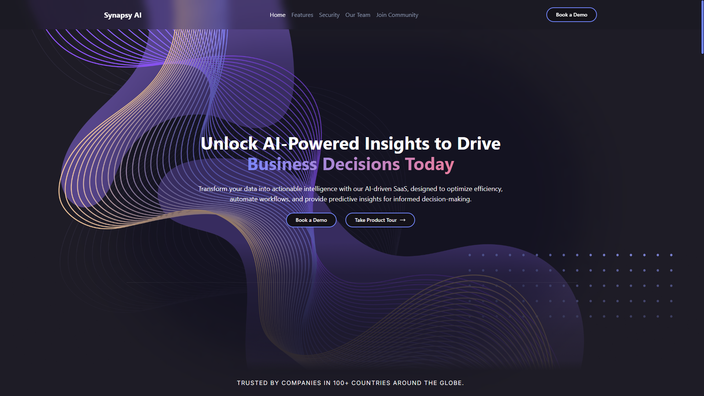
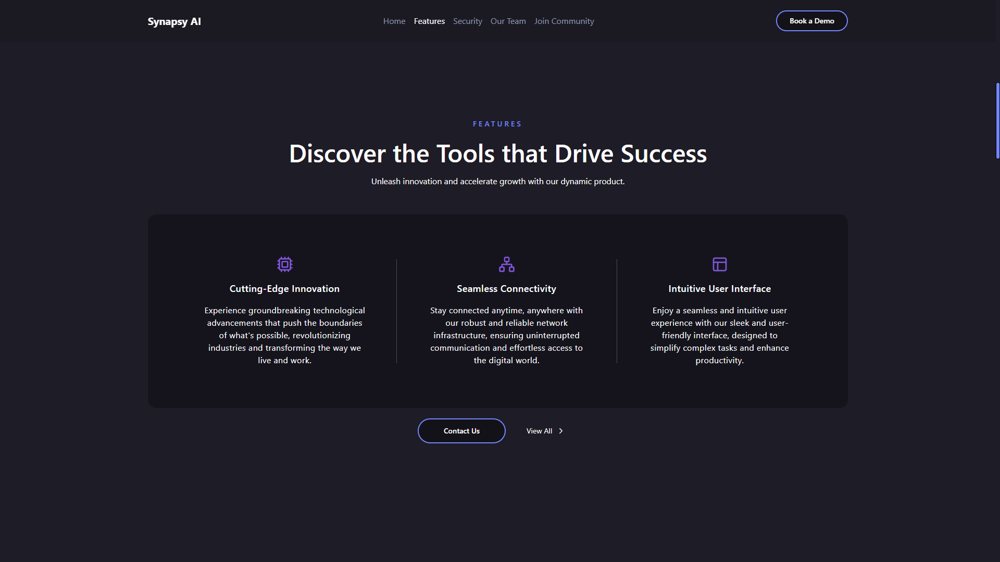
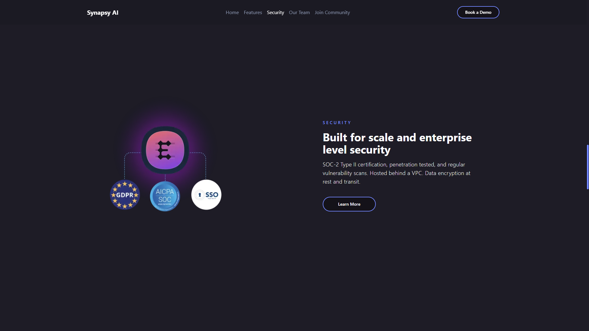
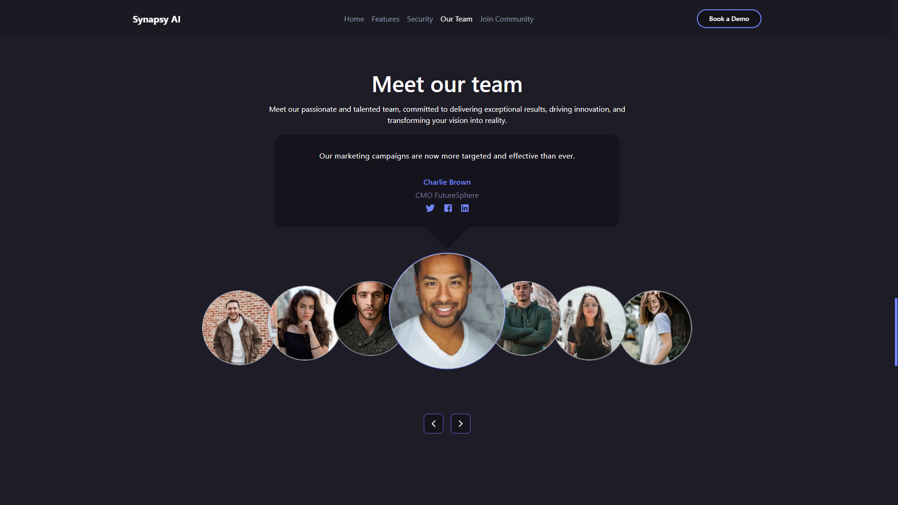
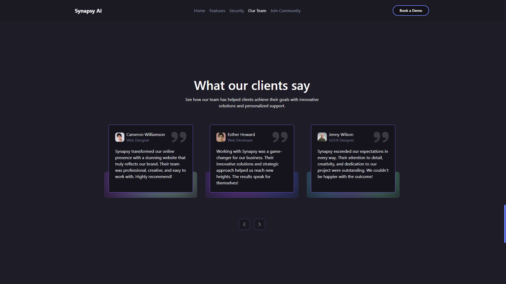
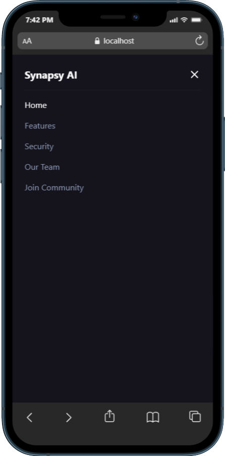

# Synapsy AI

Unlock AI-powered insights to drive business decisions today. Synapsy AI is an AI-driven SaaS platform designed to transform your data into actionable intelligence, optimize efficiency, automate workflows, and provide predictive insights for informed decision-making.

---

## Features

### Hero Section

- **AI-Powered Insights**: Unlock insights to drive business decisions.
- **Call-to-Actions**: Book a demo or take a product tour.



---

### Features Section

- **Cutting-Edge Innovation**: Experience groundbreaking technological advancements.
- **Unified View of Customers**: Integrate feedback channels seamlessly.



---

### Security Section

- **Enhanced Security**: Protect your data with advanced security measures.
- **Trust and Reliability**: Built with a focus on privacy and compliance.



---

### Our Team

- **Meet the Team**: Learn about the passionate individuals behind Synapsy AI.
- **Testimonials**: Hear from clients about their success stories.




---

## Technology

Synapsy AI is built with modern technologies to ensure a seamless and efficient experience.

**Stack:** React, Next.js, TypeScript, Tailwind CSS, Jest, ESLint, Framer Motion.

---

## Getting Started

### Prerequisites

- Node.js
- npm or yarn

### Installation

1. Clone the repository:
   ```bash
   git clone https://github.com/guilhermescr/synapsy-ai.git
   ```
2. Navigate to the project directory:
   ```bash
   cd synapsy-ai
   ```
3. Install dependencies:
   ```bash
   npm install
   ```
4. Start the development server:
   ```bash
   npm run dev
   ```

---

## Screenshots

### Hero Section


### Features Section


### Security Section


### Our Team Section


## Mobile View




---

## Links

- **Live Demo**: [https://synapsy-ai.vercel.app](https://synapsy-ai.vercel.app)
- **Repository**: [https://github.com/guilhermescr/synapsy-ai](https://github.com/guilhermescr/synapsy-ai)

---

## Reporting Issues

If you encounter any critical bugs or security vulnerabilities, please contact me directly at **devguiga@gmail.com**. Your feedback is highly appreciated and helps improve the platform!

---

## Authors

- **Guilherme Rocha**  
  Follow me on [GitHub](https://github.com/guilhermescr) and join the community!  
  Thank you for visiting, and happy AI-powered decision-making!
